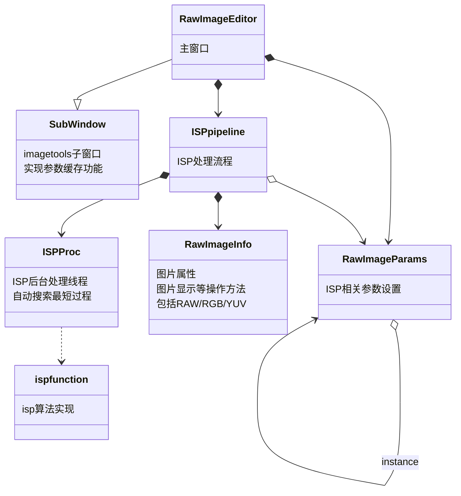

# RAW图片编辑工具
这是一款能够对RAW图进行解析和ISP处理的工具。可以方便的进行后期算法的验证（热更新、直观的图像显示和分析）。退出后会自动保存上次打开的窗口，以及窗口里的参数。同时将界面与处理线程分离，让界面更加流畅。

### 界面

1. 左侧是图像预览窗口
2. 右上角有两个窗口，左边的是RAW图的设置，右边的是ISP处理流程
3. 右下角是对ISP处理的一些配置

### 使用方法

1. **导入raw图**：先进行RAW图的设置，然后可以点击“打开图片”或者拖拽的方式打开图片，此时图片预览窗口显示的是RAW图，可以用鼠标进行放大缩小和移动，窗口的左下角会显示每个点的值，以及缩放比例
2. **ISP pipeline设置**：可以通过`勾选`的方式去启用部分ISP流程，通过`拖拽`的方式去调整ISP的顺序，然后点击确定按钮，可以进行ISP的处理，右下角的进度条可以显示ISP处理的进度。
3. **ISP 参数设置**：右下角的ISP参数设置窗口，修改参数后，也需要点击确定按钮，运行ISP。第二步和第三步ISP的处理，会对比之前的ISP流程，自动搜索最少的处理流程。右下角有处理的进度条以及耗时显示。
4. **过程中的图片查看**：`双击`ISP处理流程中的模块，可以看到经过这个模块的处理，图片变成了什么效果。此功能可以方便的看到每个ISP模块的效果。
5. **图片分析**：图片查看时点击`图片分析`按钮，会立刻显示全局的直方图统计，图片大小，平均值等信息。此时鼠标变成了选框模式，只要选中图片中的某一区域，就会显示这个区域的直方图信息，信噪比，平均值，RGB比值等信息，直方图可以挑选YRGB中的任意通道进行显示。
6. **算法调试**：如果需要进行算法的调试，修改相关ISP算法代码之后，点击`算法热更新`，可以重新加载ISP相关算法（在isp.py中），不需要重新启动程序。如果报错，弹出的窗口会显示错误信息。

### 参数设置

1. 图片格式：RAW图的宽，高，bit位数，格式和pattern，目前仅支持海思的raw图格式
2. ISP处理流程：ISP处理分为三个区域，绿色的是raw域的处理，黄色的是RGB域的处理，蓝色的是yuv域的处理。可以通过勾选的方式去启用部分ISP流程，通过拖拽的方式去调整ISP的顺序，但是调整不要超过自己的区域，如raw域的处理不能放在yuv域进行处理。
3. 黑电平：每个通道的黑电平
4. 坏点检测：调整检测的区域
5. rolloff：暗影矫正
   导入拍摄均匀光照的raw图，格式要一样
6. demosaic：去马赛克
   有三种模式：双线性插值、malver、menon实现
7. awb: 白平衡
   填入RGB的增益，也可以点击`从raw图选取`的按钮，然后用鼠标在图中选中一块灰色的区域即可，注意用来选取白平衡的图，需要是在黑电平处理过后的raw图
8. ccm: 3x3色彩校正矩阵
9. gamma：gamma值
10. LTM：局部对比度增强
    1.  暗区提升：提升暗区亮度
    2.  亮度抑制：抑制亮度亮度
11. CSC：色度空间转换RGB->YUV
    1.  是否限制YUV输出范围：TV标准中亮度的范围是16-235，PC标准是0-255，如果选中，就是采用TV标准，对比度会低一些
    2.  色域标准：BT709，BT2020, BT601三种可选
    3.  亮度、对比度、色调、饱和度调整
12. yuv denoise: 在三种频率上分别进行小波降噪
    1.  降噪强度：双边滤波的强度，值越大，降噪强度越大
    2.  噪声阈值：值越大，选取的噪声范围越大
    3.  降噪权重：值越大，降噪越强，值为0的时候，就不进行降噪
    4.  色度降噪强度：值越大，颜色降噪越强
13. yuv sharpen: 基于方向检测的锐化
    1.  3x3中值滤波强度：在锐化强进行一次中值滤波，值越大，滤波越强，值为0，就是没有进行中值滤波
    2.  锐化强度：值越大，锐化强度越大
    3.  锐化钳位阈值：控制锐化上限，避免出现白边，值越小，锐化上限越低
    4.  降噪阈值：小于这个范围的细节进行降噪，大于这个范围的细节进行锐化，值越大，降噪的范围越多

### 目前进展

目前实现了黑电平，坏点矫正，暗影矫正，去马赛克，白平衡，色彩校正，gamma，局部对比度增强，色度空间转换，对比度亮度调整，小波降噪WNR，锐化等算法

## 软件架构

主窗口继承的是Subwindow，实现了参数缓存的功能，里面创建了参数类RawImageParams和ISP处理流程类ISPpipeline。

参数类RawImageParams主要是界面上ISP相关参数的设置，组合了RAW图的格式，黑电平，去马赛克等过程的参数配置。此参数配置会缓存到本地，以便下次使用。

ISP处理流程类ISPpipeline主要是进行isp算法的处理。他会使用界面配置的参数RawImageParams，调用ISP后台处理线程进行处理。期间产生的图像，用RawImageInfo来存储。ISP后台处理线程依赖ispfunction中的算法实现，因此如果想要拓展算法，只需要修改isp.py中的实现即可。

